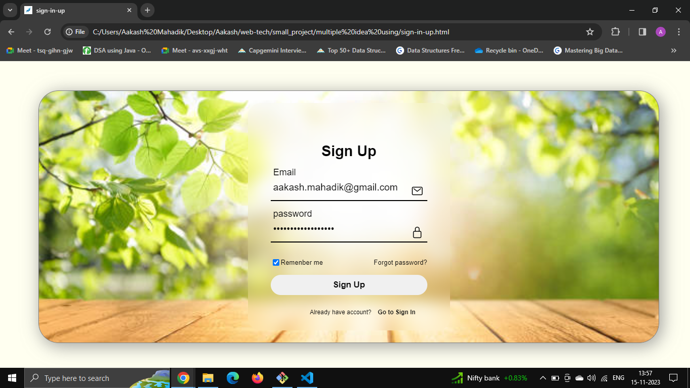

# Flip Sign-In/Sign-Up Page Project

Welcome to the Flip Sign-In/Sign-Up Page project! This simple web application provides a sign-in and sign-up page with a flip effect. The sign-in form is presented on one side, and when flipped, the sign-up form appears on the other side.

## Features

- **Sign-In Page:** Easily sign in with your existing credentials.

- **Sign-Up Page:** Create a new account by filling out the sign-up form.

- **Flip Effect:** Enjoy a smooth and visually appealing flip transition between the sign-in and sign-up pages.

## Usage

1. Clone the repository:

   ```bash
   git clone https://github.com/AakashMahadik03/Flip-Card_Sign-in-up.git

2. Open the project in your preferred code editor.

3. Open the index.html file in a web browser to experience the flip sign-in/sign-up page.

## Screenshots

1. 

2. 

## video

<video src="sign-in-up%20-%20Google%20Chrome%202023-11-15%2013-58-13.mp4" controls title="Title"></video>


